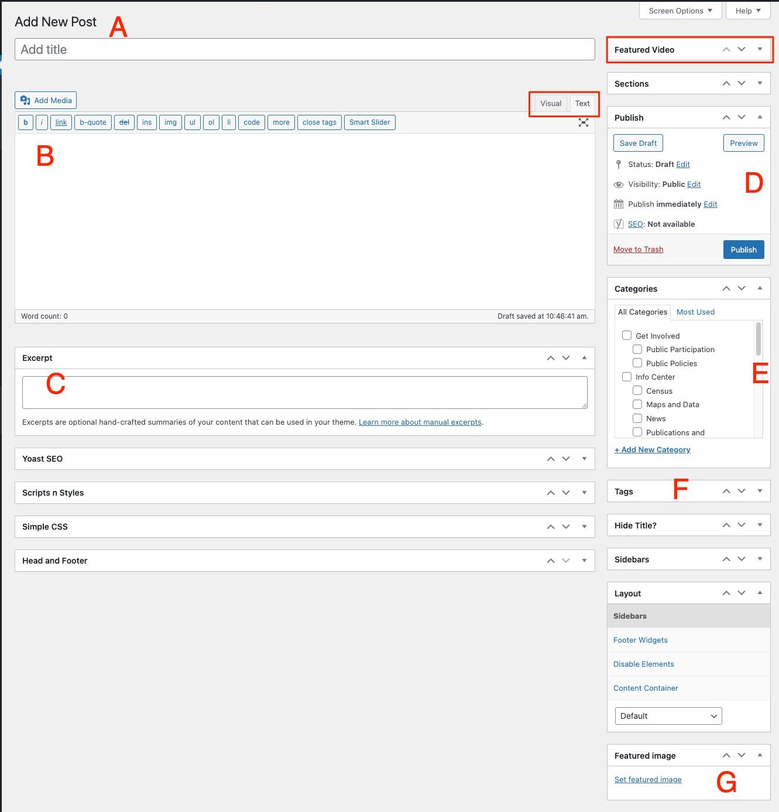

Posts are the default WordPress content vehicle, unlike Pages - which are index/landing pages that lead to deeper content. Posts _are_ that deeper content. The WP admin internace contains key fields that define the content such as hed, summary/excerpt, featured images & video, plus enhanced data (categories, tags, etc.).

## Required fields

### A) Title

This is the hed field. This also translates directly into the slug, which populates the permalink.

### B) Body

Body text can be input using WYSIWYG or text view option. HTML can be added using the text option.

### C) Excerpt

This is the summary blurb in case you want to customize. Otherwise it will just use the first 160 characters of the body text. The obvious example of when you'd want to write a custom excerpt is when your article begins with table data, like in the RTA Status Report.

NOTE: This option may not be visible for all users by default. If you don't see it in the post admin window, open the Screen Options dropdown at the top right of the page and check the Excerpt box.

### D) Status

Article status, live date, and public/private specifications go here.

### E) Category

You can have one or multiple categories. The first one you select will be the 'primary' but you can change that as needed.

### F) Tags

Adds keyword context at a more granular level than the categories.

### G) Featured image

Exactly what it says. Upload new or choose from the library.

Featured Video workflow is detailed [here](/docs/video-prod)

