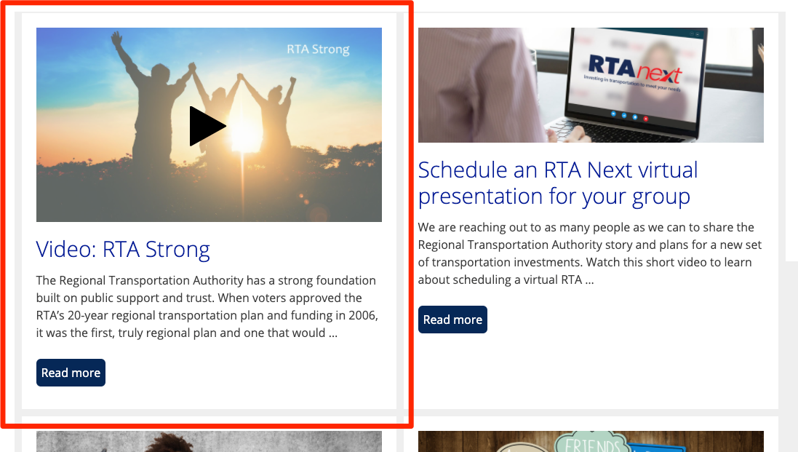

This feature allows use of third-party video platforms (YouTube, Vimeo, etc.). Upload your video to that platform, copy the share URL, and paste that URL into the field in the Post.


The first element in the right sidebar of the WP Post admin is Featured Video. There's a single field where you enter the URL. You also have the option to select a video file from the media library but that's a workaround, not the default. Enter a YouTube URL (the short one you get from the YT 'Share' interface).

Once the feature video is designated, you can then embed it with a simple shortcode:

## Embed the video in the Post

That's done using one of two shortcodes:

```html
[featured-video-plus]
```

-Displays the video in its default size. This should be responsive to screen size so I'd prefer this as the default method.

```html
[featured-video-plus width=X]
```

-Displays the video with a width of X pixels. Height will be fitted such that the aspect ratio is preserved. Should only be used in specific cases where an exact size is needed.

## Display video on index page

_Speak to the webmaster before attempting this. It's a unique case._

This one is trickier because it requires you use the video as the feature image. And the featured image slot varies in size depending on the index page logic. The prototype proven on RTA Next displayed well in the two-column presentation on the homepage, but not so well elsewhere around the site when the image size specifications changed. So we'll have to make special criteria on how this is used.



The process is the same in the WP Post admin interface: Upload to YT and apply the URL in the Post field. Then in the Featured Image module at the bottom of the right sidebar. You click the Auto Set link, which should then apply the video thubmail. Save the Post and that's it. The video will now display in the featured image slot on the individual Post pages. [Example](https://rtanext.com/rta-strong/)

:::warning
You do not want to use both options at the same time because this would show a dupe of the video. One in the featured image slot and one whever you put the embed code.
:::
